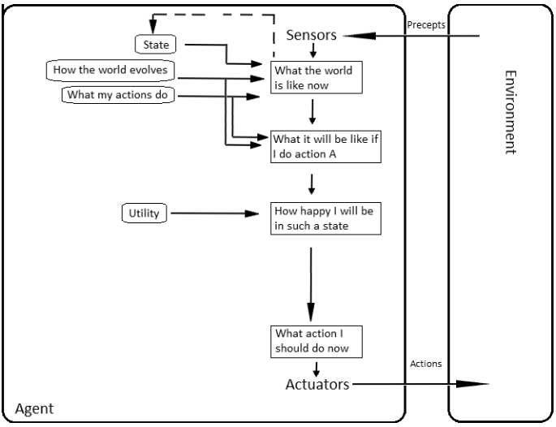
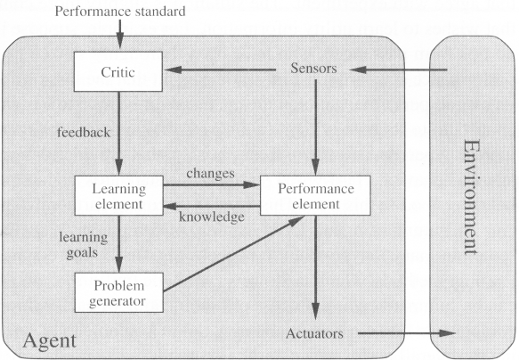

1. **Intelligent Behavior** mean learn from experience, be able to respond to new event, ambiguous event, contradictory information.

2. **Elements of Intelligent Performance** 

   * :chicken:
   * :pizza:

3. **Artificial Intelligence** is a branch of computer science devoted to create computer hardware or software that could mimic the human's intelligence.

4. **Human vs Computer**

   | Computer                                 | Human                                                        |
   | ---------------------------------------- | ------------------------------------------------------------ |
   | store, retrieve large amount of data     | ambiguous, incomplete, noisy, haven't seen, unexpected, unique aren't a problem |
   | processing large amount of data          | recognize relationship pattern between things                |
   | fast                                     | combining inputs from different sensor                       |
   | hard calculation accurately              | learn new things and change behavior                         |
   | no fatigue (as long as have electricity) | Banana​ :banana:                                              |

5. **Brain** can understand what its doing while **Computer** doesn't, so is to create a brain in form of computer that can learn by itself

6. **Turing Test** is inquiry (an act of asking information) to determine whether or not a computer can think like human.

7. **Cognitive Task**: process new information and store, retrieve information from memory and use that information at a later time. Ex:

   * :green_apple:
   * :pineapple:

8. **Math** and different other things play a huge role in AI, such as

   * (*Computation*, *Logic* and *Probability*)

   * (*Psychology*: thinking and acting) can be use to provide reasoning model for AI
   * *Control Theory and Cybernetics* adjust their actions to achieve better result in an environment with objective and feedback of environment
   * *Computer Engineering* we need this,so that our AI application work efficiently. we need to understand time-sharing, the linked list, OOP, etc.
   * *Linguistics* for understand natural language
   * Neuroscience allow us to understand how brain compute

9. **Symbolic AI** attempt to create somethings that represent human knowledge in declarative form. (example: facts and rules)

10. **Non-Symbolic AI** concern with obtaining the correct response to an input stimulus without caring of what happen inside exactly.

11. **Rational Agent** one that can take the right decision (optimal) in every situation. 

12. **Intelligent Agent or Agent (in slide)** entity in a program or environment capable of generating action by using perception of environment (use sensor) to decide. 

13. **Agent Function** mathematical function that map a sequence of sequence perception into an action.

    

14. **Vacuum Cleaner Agent** :ramen:

15. **Agent vs Program**

    * Size: agent is smaller
    * Purpose: agent has specific purpose, program is multi-functional..
    * Persistence: agent is not depend on a user's launching and quitting
    * Autonomy: agent doesn't need user's input

16. **Performance Measure** could be measured based on the effect of the environment, not based on what the agent think.

17. **Good Behavior** **(The concept of rationality)** 

    * The performance measure
    * Agent's knowledge of the environment (more input of environment)
    * Action that it is capable of performing (more action better)
    * The current sequence of perceptions

18. **Exploration** agent can perform action to gather information from the environment. *Example* Vacuum Cleaning in an unknown environment

19. **Autonomy** agent can learn and correct itself (usually by learning). *Example* Vacuum cleaner for cleaning dirt.

20. **Task environments** are the problems and **Rational agents** are the solutions.

21. **PEAS** 

    * Performance
    * Environment
    * Actuators
    * Sensors

22. **Automated Taxi Driver** Watermelon

23. **Using PEAS** with example *Automated Taxi Driver*

    

24. **Task environment**

    1. **Fully observable** mean that the inputs from environment (that are relevant to the choice of action) is effective and fully observable. 
    2. **Partially observable** mean that the inputs from environment are partially observable because of noisy and inaccurate sensors which could affect the choice of action.
    3. **Deterministic** mean that the current state and the actions could completely determined the future state. stochastic is the opposite
    4. **Episodic** current action or future action have no connection (each state independent). **Sequential** current action may affect all future decisions
    5. **Dynamic Environment** is always changing over time while **Static** environment doesn't. **Semi Dynamic** is environment that doesn't change, but the agent's performance score does.
    6. **Discrete Environment** has a limited number of distinct states, while **Continuous Environment** has many distinct states.
    7. **Known Environment** agent might know all the outcomes for all actions, while **Unknown Environment** need to learn how it works to make good decisions.
    8. **Single Agent** when there is only one agent interacting with the environment, but **Multi agent** when there are multiple agents communicate with each other and their environment.

25. **Agent** = **architecture** + **program**

    1. *architecture* some sort of computing device
    2. *agent program* job of AI

26. **Agent programs** 

    1. Input for Agent Program : new current percept)
    2. Input for Agent function (Look up table) : entire sequence of percept because it has to remember all of them
    3. Return action

27. **The key challenge of AI**: action from a small amount of code instead of ultra extremely ultimate absolutely gigantic exceptionally big

    

28. **Type of agent programs**:

    1. Simple reflex agents
       
       * use *if ... then ...*, efficient but limited intelligence because knowledge sometimes cannot be stated explicitly (fully observable)
       * Example: Frog : if small obj then snap if large obj then avoid else idle
       * 
       
    2. Model-based reflex agents

       * The agent work by keep track of an internal state based on percept history plus some of the unobserved aspects (partially observable).
       * requirements are needed to know to update internal state:
         * how the world evolve independently from the agent
         * how the agent's actions affect the environment

       

    3. Goal-based agents

       * current state of the environment is not always enough, we also need to define goal information to describe a desirable situations.

       

    4. Utility-based agents

       

       

        Credits: https://gungorbasa.com/intelligent-agents-agent-programs-main-type-of-agents-58395d3c1733

29. **Learning agents** programmed agent still need learning. we need to teach it by a set of examples and test it with a set of examples

    * Four conceptual components:
      * Learning element: making improvement
      * Performance element: Select external actions
      * Critic: tell the learning element how well the agent is doing. Feedback from user or examples, good or not.
      * Problem generator: suggest actins that will lead to new and informative experiences.

    

30. **Agent based Modeling (ABM)** is an entity that functions continuously and autonomously in an environment which other processes and other agents exist, in short, agent 

31. **Simulation modeling **create and analyze a digital prototype of physical model to predict its performance in real world.

    

32. **Wolf-sheep predation in Repast Symphony** :sheep: eat :wolf: ------- :wolf: eat :herb: ----- :wolf: can make :baby: randomly (swap role)

33. **Complexity** is running time and space to execute a process

    * Time Complexity
    * Space Complexity

34. **Basic Operation** is *Basic Operation* :laughing:. Example searching need comparison (basic operation)

35. **Space Complexity** is the amount of memory required to solve the given problem. 

    * *Fixed Part* is needed for instruction space
    * *Variable Part* is needed for input and output data
    * Space = Fixed part + Variable part

36. **Time Complexity** is the time required to analyze the given problem.

    * *Fixed part* is compile time
    * *Variable part* is run time dependent on problem instance.
    * Ways to measure Time Complexity
      1. Stop watch
      2. Step count
      3. Rate of Growth (Asymptotic Notations)

37. **Asymptotic Notation** are the expression that are used to represent the complexity of an algorithm.

    1. Big-O Notation (Ο) – Big O notation specifically describes worst case scenario.

       
algorithm can be completed faster than this

    2. Omega Notation (Ω) – Omega(Ω) notation specifically describes best case scenario.

       
algorithm cannot be completed in less time than this

    3. Theta Notation (θ) – This notation represents the average complexity of an algorithm.

       
algorithm can be completed around the upperbound and the lowerbound

    

38. **Problem solving agent** similar to goal based agent.,but this one finds sequences of actions that lead to desirable states. The searching algorithm helps us to search for solution of particular **problem**.

    * Goal > Problem > Search > Execute

    

    * It needs a representation of the problem and algorithm that use some strategy to solve it

39. **Problem representation** 

    * *State* is a representation of many elements in a certain time or a moment of time.

    1. **State Space** a problem is divided into a set of different state which consist of initial state and goal state.

    2. **Reduction to sub-problems** all states are represented as node of graph

       

40. **Successor Function** a function that generates the next state from the current state, plus the choices that affect state changes.

