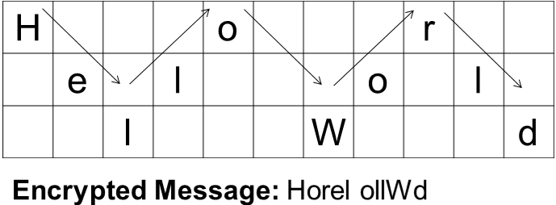
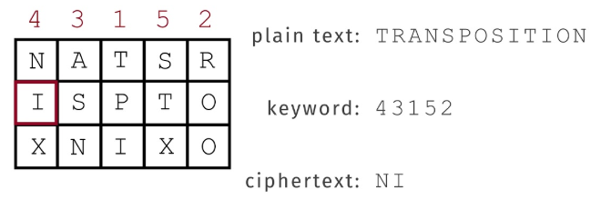

1. **Computer Security** is the protection of computing systems and the data they store or access.

2. **Network Security** is measures to protect data during their transmission.

3. **Web Security** is the process of securing stored online from unauthorized access and modification.

4. **Aspects of Security**

   | Name               | Details                                                      |
   | ------------------ | ------------------------------------------------------------ |
   | Security Attack    | Active attack, Passive Attack                                |
   | Security Service   | Authentication, Access Control, Data Confidentiality, Data integrity, Non-Repudiation |
   | Security Mechanism | encipherment, digital signatures, access controls, data integrity, authentication exchange, traffic padding, routing control,notarization |

5. **Threat** is a potential for violation of security.

6. **Security Attack** is a deliberate attempt to evade security services and violate the security policy of a system

   | Active Attack      | attempts to alter system resources or affect their operations. |
   | ------------------ | ------------------------------------------------------------ |
   | **Passive Attack** | **attempts to learn or make use of information from the system but does not affect system resources.** |

7. **Security Service** are any services that protect data processing systems and information (storing or transferring) of an organization. 

8. **Security Mechanism** are features that detect, prevent or recover from a security attack.

9. **Cryptanalysis** is the process deciphering coded messages without being told the key.

   | Approach             | Definition                           |
   | -------------------- | ------------------------------------ |
   | Cryptanalytic attack | study the coded text                 |
   | Brute-force attack   | try every combination or all the key |

10. **Unconditional Security** mean no matter how much power or time you have because it doesn't provides enough information (to determine the corresponding plain text).

11. **Computational Security** mean the time that is needed for calculations is so long (the age of universe) which mean people won't even bother to break the cipher

12. **Classical Encryption Techniques** (illustrate basic approaches)

    | Name          | Definition                                                   |
    | ------------- | ------------------------------------------------------------ |
    | Substitution  | letters of plaintext are replaced by other letters or numbers or symbols or bit patterns |
    | Transposition | rearranging the letter order to encrypt the message          |

13. **Caesar Cipher** shift all the letters in the plain text, *example* : meet > PHHW (key:3)

14. **Monoalphabetic Cipher** each plain text letter maps to a different random ciphertext letter.

    ***Note***:  *Monoalphabetic Cipher* might seem secure, but it's not because of English letter frequencies and the relative between each letter.

15. **Playfair Cipher** create a 5x5 matrix, fill in letters of keyword (no duplicate) and fill the rest of matrix with other letters.

16. **Rail Fence** write message letters out diagonally over a number of rows.

    

17. **Row Transposition** write letters of message as rows but take column as ciphertext

    

    ***Note:*** Both Substitution and Transposition is not secure because of language characteristics.

18. **Product Cipher** combines two or more transformations so that the cipher text is more secure (make it resistant to cryptanalysis)

19. **Rotor Machines** used a series of cylinders (each give one substitution)  which rotated and changed after each letter was encrypted.

20. **Steganography** hide existence of message (using invisible ink, hiding in LSB (idk) in graphic image or sound file)

21. **One-Time Pad** unbreakable and hard to distribute the key every time we send the message.

    ***Note***: Limitation of message size might be the weakness, too.

    

    

    

22. **Symmetric Ciphers** encryption and decryption are done by one key.

23. **Block Ciphers** symmetric key + algorithm apply on block of data (no less than 1 byte) (mostly use)

24. **Stream Ciphers** plaintext > ciphertext by encrypt 1 bit or 1 bytes only at a time.

25. **Feistel Structure** 

    * Round:

      split block into 2 (L and R) => R and subkey as input of a function (algorithm) => result XOR with L => swap L and R

    

26. **Data Encryption Standard (DES)** :poop:

27. **Advanced Encryption Standard (AES)** :poop:

28. **Key Distribution**

    * Symmetric scheme require both parties to share a common secret key. so the problem is how can we distribute key

    * we have many different ways to distribute key

      * A can select and physically deliver the key
      * A can let a third party first point
      * Old key can unlock a new key
      * if A & B have secure communication with C, C can be a third party

    * Key Hierarchy

      * **Session key** is an encryption and decryption **key** that is randomly generated to ensure the security of a communications **session** between a user and another computer or between two computers.
      * **Master key** is used to encrypt session key which is shared by user & key distribution center

    * Issues

      * session key lifetimes should be limited for greater security

      * we have to trust KDC, the system and make sure it's protected or we can use decentralized key distribution instead but it's good for local context only

      * controlling key usage mean that key can be divided on the basis of usage

        * Example: Data encryption key, PIN-encryption key, File encrypting key
        * We also need something to limit the ways which the key is used. Simple plan is to attach 8 bit tag with each 64 bit key
        * Example: One bit : session or master , one bit : encryption , one bit : decryption , remaining : future use

        

